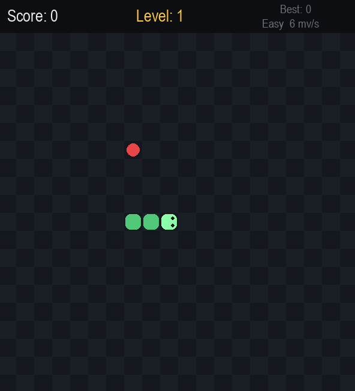

# Snake

A Python Snake game built with Pygame, featuring multiple difficulty levels, progressive speed, bonus food, obstacles, persistent high scores, pause and help screens.

## Features

### Game Modes

* Easy mode

  * Walls wrap around
  * Slower starting speed
  * No rocks

* Normal mode

  * Walls are deadly
  * Medium starting speed
  * No rocks

* Hard mode

  * Walls are deadly
  * Faster starting speed
  * Rocks are added as the level increases

### Gameplay

* Snake movement using Arrow Keys or WASD
* Food increases the score and lengthens the snake
* Normal food gives 10 points
* Golden bonus food gives 30 points
* Golden bonus food appears temporarily
* New level every 5 foods
* Snake speed increases with each level
* Maximum speed limit
* Collision detection with the snake and obstacles
* Different difficulty-based gameplay behavior

### High Scores

* Best score is tracked separately for each difficulty
* High scores are saved locally in `highscore.json`
* New best score notification

### Game Interface

* Main menu with difficulty selection
* Help screen
* Pause screen
* Game Over screen
* Score and level display
* Current difficulty and movement speed display
* Level-up notification

## Controls

| Key               | Action                    |
| ----------------- | ------------------------- |
| Arrow Keys / WASD | Move the snake            |
| P                 | Pause / Resume            |
| H                 | Open Help                 |
| Enter / Space     | Start or restart the game |
| ESC               | Return to menu / Quit     |

## Screenshots

### Main Interface


### Gameplay



## Technologies

* Python 3
* Pygame
* `random`
* `json`
* `os`

## How to Run

### Requirements

* Python 3.x
* Pygame

Install Pygame:

```bash
pip install pygame
```

### Run the Game

Clone the repository:

```bash
git clone https://github.com/Jaafar-Daoud-AC/Snake.git
```

Navigate to the project directory:

```bash
cd Snake
```

Run the game:

```bash
python snake.py
```

## Project Structure

```text
Snake/
├── snake.py
├── highscore.json
├── README.md
└── screenshots/
    ├── Main Interface.PNG
    └── game.PNG
```

## Project Status

**Completed — Version 2**

Future improvements may be added.

## Author

**Jaafar Daoud**

Applied Communications Engineer

GitHub: [Jaafar-Daoud-AC](https://github.com/Jaafar-Daoud-AC)
